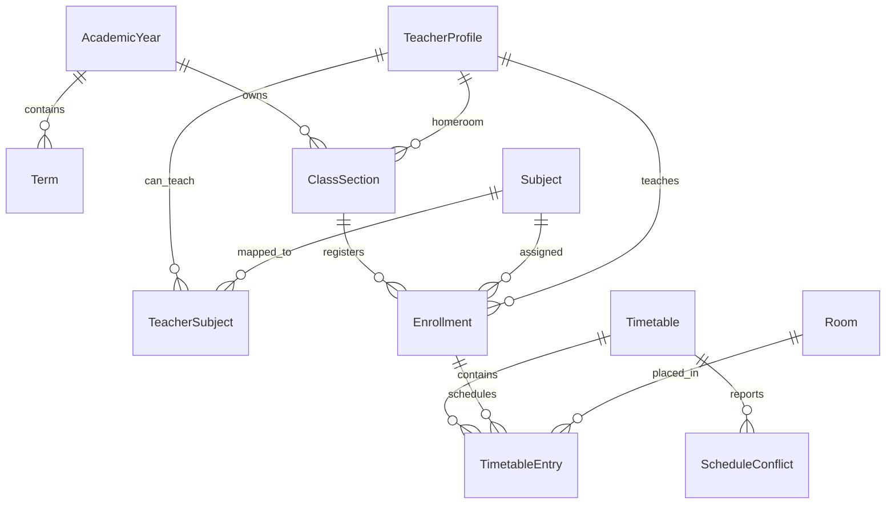
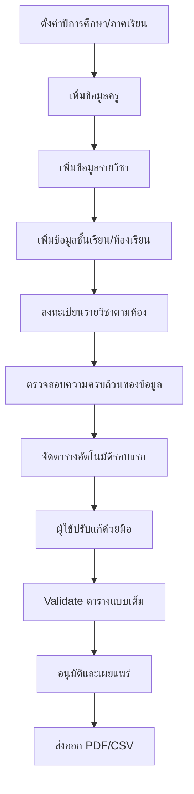
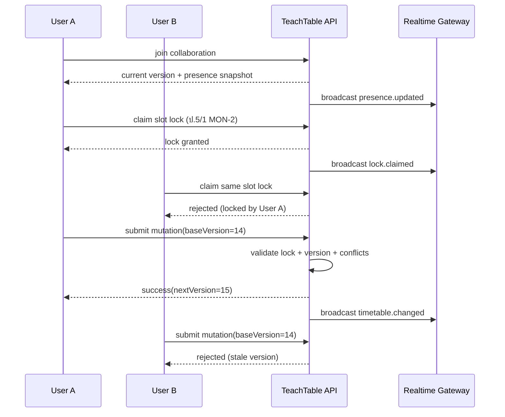

# TeachTable: เอกสารออกแบบระบบจัดการตารางเรียนและตารางสอน

## 1. สรุปแนวคิดระบบ

TeachTable เป็นระบบสำหรับบริหารข้อมูลครู รายวิชา ชั้นเรียน ห้องเรียน และการลงทะเบียนรายวิชา เพื่อสร้างตารางเรียนและตารางสอนอย่างเป็นระบบในโรงเรียน โดยออกแบบให้รองรับ 2 ช่วงชั้นหลักคือ `ประถมศึกษา` และ `มัธยมศึกษาตอนต้น` พร้อมความสามารถในการจัดตารางแบบอัตโนมัติและกึ่งอัตโนมัติ ตรวจสอบเวลาชนกันแบบ Real-time และส่งออกเอกสารราชการในรูปแบบ `PDF A4` และ `CSV`

แนวคิดหลักของระบบมี 4 แกน:

- `Master Data First`: บริหารข้อมูลพื้นฐานให้ถูกต้องก่อนจัดตาราง
- `Constraint-Driven Scheduling`: ใช้เงื่อนไขจริงของโรงเรียนเป็นตัวควบคุมการจัดคาบ
- `Operational Dashboard`: เห็นสถานะรวม ปัญหา และความพร้อมใช้งานได้ทันที
- `Printable Output`: เอกสารที่พิมพ์ได้จริง มีส่วนลงลายเซ็นและข้อมูลโรงเรียนชัดเจน

## 2. วิเคราะห์ Requirement แบบแยกหมวด

### 2.1 Master Data

ระบบต้องจัดการข้อมูลหลักดังนี้

- ระดับการศึกษา: ประถมศึกษา, มัธยมศึกษาตอนต้น
- ปีการศึกษาและภาคเรียน
- ห้องเรียนและชั้นเรียน
- ครูผู้สอนและครูประจำชั้น
- รายวิชาและชั่วโมงเรียนต่อสัปดาห์
- การลงทะเบียนรายวิชาแยกตามห้องเรียน
- ห้องพิเศษหรือห้องเฉพาะ เช่น ห้องวิทยาศาสตร์, ห้องคอมพิวเตอร์

### 2.2 Scheduling

- ตารางเรียนรวม `30 ชั่วโมงต่อสัปดาห์`
- เรียน `วันจันทร์-ศุกร์`
- วันละ `6 คาบ`
- ผู้ใช้ต้องจัดตารางเองได้บางส่วน และให้ระบบช่วยจัดต่อได้
- ต้องรองรับการสลับคาบด้วยการลากวางหรือเลือกช่องเวลา
- ต้องมีระบบแนะนำช่องเวลาว่างที่เหมาะสม

### 2.3 Validation

ต้องตรวจสอบอย่างน้อย 6 กลุ่มเงื่อนไข

- ครูคนเดียวกันห้ามสอนชนกันในเวลาเดียวกัน
- ห้องเรียนเดียวกันห้ามมีหลายวิชาซ้อนกัน
- ชั้นเรียนเดียวกันห้ามมีหลายวิชาซ้อนกัน
- ชั่วโมงสอนรวมของครูต้องไม่เกินค่าสูงสุด
- รายวิชาที่ลงทะเบียนต้องถูกจัดครบตามชั่วโมงที่กำหนด
- ห้องเรียนแต่ละห้องต้องครบ `30 ชั่วโมง` และ `6 คาบต่อวัน`

### 2.4 UX/UI

เป้าหมาย UX/UI คือระบบที่ “อ่านง่าย ควบคุมง่าย ตัดสินใจเร็ว”

- Dashboard ต้องสรุปสถานะได้ภายในไม่กี่วินาที
- ฟอร์มต้องแบ่ง section ชัดเจน เช่น ข้อมูลทั่วไป, ภาระสอน, สิทธิ์ผู้ใช้งาน
- หน้าจัดตารางต้องเห็น “ตารางหลัก + conflict panel + inspector” พร้อมกัน
- สีของวิชาหรือกลุ่มสาระต้องช่วยสแกนข้อมูล ไม่ใช่แค่ตกแต่ง
- ปุ่มสำคัญ เช่น `บันทึก`, `ตรวจสอบ`, `จัดอัตโนมัติ`, `ส่งออก PDF`, `ส่งออก CSV` ต้องอยู่ตำแหน่งที่คาดเดาได้

### 2.5 Reporting and Export

- ส่งออกตารางรายห้อง
- ส่งออกตารางรายครู
- ส่งออกรายสัปดาห์แยกระดับการศึกษา
- ส่งออก CSV สำหรับนำเข้า Excel หรือระบบอื่น
- ส่งออก PDF A4 สำหรับพิมพ์ใช้งานจริงพร้อมลายเซ็น

## 3. ออกแบบโครงสร้างฐานข้อมูล

ฐานข้อมูลควรใช้แนวทาง normalized schema เพื่อรองรับการตรวจสอบเงื่อนไขและขยายระบบในอนาคต

### 3.1 Entity หลัก

- `AcademicYear`
- `Term`
- `ClassSection`
- `TeacherProfile`
- `Subject`
- `SubjectOffering`
- `TeacherSubject`
- `Enrollment`
- `Room`
- `Timetable`
- `TimetableEntry`
- `ScheduleConflict`
- `User`

### 3.2 ความสัมพันธ์สำคัญ

- 1 ปีการศึกษา มีหลายภาคเรียนและหลายห้องเรียน
- 1 ห้องเรียน มีหลาย enrollment
- 1 enrollment ผูกกับ 1 วิชา + 1 ครู + 1 ห้องเรียน
- 1 timetable มีหลาย timetable entries
- 1 timetable entry อ้างอิงครู วิชา ห้องเรียน ห้องสอน และช่วงเวลา

### 3.3 ERD แบบย่อ



### 3.4 หลักคิดเชิงข้อมูล

- เก็บ `Enrollment` แยกจาก `TimetableEntry` เพื่อรู้ว่า “วิชาไหนต้องเรียนกี่ชั่วโมง” ก่อนนำไปจัดจริง
- เก็บ `ScheduleConflict` แยกจาก `TimetableEntry` เพื่อรองรับการแจ้งเตือนและ audit trail
- ใช้ unique constraint ในระดับฐานข้อมูลเพื่อกันความผิดพลาดพื้นฐาน เช่น ครูชนกันหรือห้องชนกันใน timetable เดียว

รายละเอียด schema อ้างอิงได้จาก [schema.prisma](C:/Users/401ms/Desktop/TeachTable/infra/database/schema.prisma)

## 4. ออกแบบหน้าจอทั้งหมดของระบบ

### 4.1 Dashboard

องค์ประกอบหลัก

- KPI: จำนวนครู, ห้องเรียน, รายวิชา, ตารางที่จัดแล้ว
- Schedule health: เปอร์เซ็นต์ความครบถ้วน, จำนวน conflict, จำนวนวิชาที่ยังไม่ลงครบ
- Alert feed: รายการปัญหาที่ต้องแก้ทันที
- Progress by level: ประถมศึกษา vs มัธยมศึกษาตอนต้น
- Quick actions: เพิ่มข้อมูล, ตรวจสอบตาราง, จัดอัตโนมัติ, ส่งออกเอกสาร

### 4.2 หน้าจัดการครู

- ตารางรายชื่อครู
- ค้นหาตามชื่อ รหัสครู บทบาท
- แสดงภาระสอนรวมต่อสัปดาห์
- ฟอร์มเพิ่ม/แก้ไขพร้อมวิชาที่สอนได้และชั่วโมงสูงสุด

### 4.3 หน้าจัดการรายวิชา

- ค้นหาตามรหัสวิชา ชื่อวิชา กลุ่มสาระ ระดับชั้น
- ฟอร์มกำหนดหน่วยกิต ชั่วโมงต่อสัปดาห์ และระดับที่เปิดสอน
- แสดงครูที่มีสิทธิ์สอนวิชานั้น

### 4.4 หน้าจัดการชั้นเรียนและห้องเรียน

- เลือกปีการศึกษาและภาคเรียน
- แสดงห้องเรียนทั้งหมดแยกตามระดับการศึกษา
- กำหนดครูประจำชั้น
- ดูภาระชั่วโมงรวมของห้องและสถานะความครบถ้วน

### 4.5 หน้าลงทะเบียนรายวิชา

- เลือกห้องเรียน
- เลือกรายวิชาและครูผู้สอน
- กำหนดจำนวนชั่วโมงที่ต้องลงตาราง
- แจ้งเตือนทันทีหากชั่วโมงรวมเกิน 30 ชั่วโมง

### 4.6 หน้าจัดตาราง

หน้าจอหลักต้องมี 3 พื้นที่พร้อมกัน

- `Workspace`: ตารางรายสัปดาห์ 5x6
- `Inspector`: รายละเอียดคาบที่เลือก ครู ห้อง วิชา หมายเหตุ
- `Conflict Panel`: ปัญหาที่เกิดขึ้นและคำแนะนำช่องว่างที่ใช้ได้

ฟังก์ชันสำคัญ

- สลับมุมมองรายห้อง / รายครู
- ลากวางคาบเรียน
- คลิกเพื่อแก้ไขคาบ
- Auto schedule
- Validate schedule
- Filter ตามระดับ ปีการศึกษา ภาคเรียน

### 4.7 หน้าส่งออกเอกสาร

- เลือกรูปแบบ: รายห้อง, รายครู, รายระดับ
- เลือกปีการศึกษา ภาคเรียน ระดับชั้น ห้องเรียน
- แสดง preview ก่อน export
- เลือกใส่โลโก้โรงเรียน ชื่อสถานศึกษา และวันที่พิมพ์

### 4.8 หน้าตั้งค่า

- ชื่อโรงเรียน โลโก้ ข้อมูลผู้บริหาร
- รูปแบบชื่อผู้ลงนาม
- ค่า default เช่น จำนวนคาบต่อวัน, วันเรียน, ภาษาเอกสาร
- สิทธิ์ผู้ใช้งานและบทบาท

## 5. ออกแบบ Workflow การทำงานของผู้ใช้



### Workflow สำหรับฝ่ายวิชาการ

1. สร้างปีการศึกษาและภาคเรียน
2. ตรวจสอบ master data ให้ครบ
3. ลงทะเบียนรายวิชาของทุกห้อง
4. ใช้ระบบจัดตารางอัตโนมัติ
5. ตรวจ conflict ที่เหลือ
6. ปรับแก้คาบเฉพาะจุด
7. Validate และอนุมัติ
8. ส่งออกเอกสารและแจกจ่าย

### Workflow สำหรับครู

1. เปิดดูตารางสอนของตนเอง
2. ตรวจสอบภาระสอนรวม
3. ดาวน์โหลด PDF หรือ CSV

## 6. ออกแบบ Logic การจัดตารางและป้องกันเวลาชนกัน

## 6.1 Constraint หลัก

Hard constraints

- ห้องเรียนหนึ่งห้องมีได้ 1 คาบต่อช่วงเวลา
- ครูหนึ่งคนสอนได้ 1 ห้องต่อช่วงเวลา
- ห้องสอนหนึ่งห้องใช้ได้ 1 รายการต่อช่วงเวลา
- enrollment ต้องถูกจัดครบตาม `requiredPeriodsPerWeek`
- ชั่วโมงรวมต่อห้องต้องครบ 30 ชั่วโมง
- ต้องมี 6 คาบต่อวัน

Soft constraints

- กระจายวิชาไม่ให้กระจุกในวันเดียว
- หลีกเลี่ยงวิชาเดียวติดกันเกิน 2 คาบ
- กระจายภาระสอนครูให้สมดุล
- ใช้ห้องพิเศษเมื่อจำเป็นก่อน

## 6.2 ขั้นตอนของ Scheduling Engine

1. ตรวจความครบถ้วนของ master data
2. แปลง enrollment เป็นงานที่ต้องวางลง 30 slot ต่อห้อง
3. จัดลำดับ enrollment ที่จัดยากก่อน เช่น ชั่วโมงมาก ครูว่างน้อย ห้องพิเศษจำกัด
4. คำนวณช่องเวลาที่เป็นไปได้ของแต่ละ enrollment
5. ให้คะแนนแต่ละช่องเวลา
6. วางคาบทีละรายการ
7. หากวางไม่ได้ ให้ขึ้นรายการ unresolved พร้อมเหตุผล
8. รัน validate อีกรอบทั้งระบบ

## 6.3 Scoring แนวทางหนึ่งที่เหมาะกับโรงเรียน

คะแนนเริ่มต้นต่อ slot = 100

- `+20` ถ้าเป็นช่วงเวลาที่ผู้ใช้แนะนำหรือกำหนด preferred slot
- `+10` ถ้าวันนั้นห้องเรียนยังมีคาบน้อยกว่าวันอื่น
- `-15` ถ้าครูมีคาบติดกันมากเกินไป
- `-20` ถ้าวิชาเดียวกันอยู่ในวันเดียวกันแล้ว 2 คาบ
- `-30` ถ้าต้องใช้ห้องพิเศษแต่ห้องเหลือน้อย

## 6.4 การป้องกัน Conflict แบบ Real-time

เมื่อผู้ใช้ลากวิชาไปวางในตาราง ระบบต้องตรวจทันที 3 ชั้น

ชั้นที่ 1: Frontend validation

- เช็กช่องนั้นว่างหรือไม่
- เช็กครูชนกับคาบอื่นหรือไม่
- เช็กห้องสอนชนหรือไม่

ชั้นที่ 2: Backend service validation

- โหลด timetable ปัจจุบัน
- รัน conflict engine ทั้ง slot ที่เกี่ยวข้อง
- คืนผลเป็นโครงสร้าง conflict พร้อมข้อความที่อธิบายได้

ชั้นที่ 3: Database constraint

- unique key กันข้อมูลซ้ำที่ critical

## 6.5 รูปแบบข้อความแจ้งเตือนที่ควรใช้

- `ครู อารียา ศรีสุข สอนซ้อนในวันอังคาร คาบ 3 ระหว่างห้อง ป.5/1 และ ม.2/2`
- `ห้องวิทยาศาสตร์ถูกใช้งานซ้ำในวันพุธ คาบ 4`
- `ห้อง ป.4/2 ยังจัดตารางไม่ครบ 30 ชั่วโมง เหลือ 2 ชั่วโมง`
- `รายวิชา ว23101 วิทยาศาสตร์ ม.2/1 ลงครบเพียง 2 จาก 3 ชั่วโมง`

โค้ดตัวอย่างดูได้ที่

- [conflict-engine.ts](C:/Users/401ms/Desktop/TeachTable/apps/api/src/scheduling/conflict-engine.ts)
- [auto-scheduler.ts](C:/Users/401ms/Desktop/TeachTable/apps/api/src/scheduling/auto-scheduler.ts)

## 7. เสนอ Tech Stack ที่เหมาะสม

### Frontend

- `React + TypeScript + Vite`
- `TanStack Router` สำหรับ route structure ที่ชัด
- `TanStack Query` สำหรับ data fetching และ cache
- `React Hook Form + Zod` สำหรับฟอร์มและ validation
- `dnd-kit` สำหรับ drag and drop ตาราง
- `Framer Motion` สำหรับ motion ที่ช่วยการรับรู้สถานะ

เหตุผล

- เร็ว เบา ดูแลง่าย
- Type safety ดี
- รองรับการแยก feature module ชัดเจน

### Backend

- `NestJS + TypeScript`
- `Prisma ORM`
- `PostgreSQL`
- `Redis + BullMQ` สำหรับ background jobs เช่น export จำนวนมาก

เหตุผล

- NestJS เหมาะกับระบบองค์กรและ service layer ที่ซับซ้อน
- Prisma ชัดเจนเรื่อง schema และ migration
- PostgreSQL จัดการ relation และ transaction ได้ดี

### Export and Document

- `Python + ReportLab` สำหรับ PDF ที่ต้องควบคุม layout แบบเอกสารราชการ
- `Node service` สำหรับ CSV export

### Infrastructure

- `Docker`
- `Nginx`
- `GitHub Actions`
- `S3-compatible object storage` สำหรับเก็บไฟล์ export

## 8. Folder Structure ของโปรเจกต์

```text
TeachTable/
├─ apps/
│  ├─ api/
│  │  ├─ src/
│  │  │  ├─ api/
│  │  │  ├─ collaboration/
│  │  │  ├─ domain/
│  │  │  ├─ export/
│  │  │  └─ scheduling/
│  │  └─ tests/
│  └─ web/
│     ├─ app.js
│     ├─ index.html
│     └─ styles.css
├─ docs/
│  └─ teachtable-system-design-th.md
├─ infra/
│  └─ database/
│     └─ schema.prisma
├─ services/
│  └─ pdf-worker/
│     └─ generate_timetable_pdf.py
└─ README.md
```

## 9. โค้ดตัวอย่างที่สำคัญ

ไฟล์อ้างอิงใน repo นี้ครอบคลุมตัวอย่างหลัก 5 กลุ่ม

- `Database schema`
- `Conflict engine`
- `Auto scheduler`
- `CSV export`
- `PDF A4 export`

แนวทางใช้งาน

- ใช้ schema เป็นฐานสำหรับ migration จริง
- นำ conflict engine ไปผูกกับ API สำหรับ validate slot และ validate timetable
- ใช้ auto scheduler เป็น heuristic layer ก่อนต่อยอดเป็น constraint solver เต็มรูปแบบ
- ใช้ PDF worker สำหรับเอกสารอนุมัติและเอกสารพิมพ์แจก

## 10. อธิบายการ Export PDF A4 และ CSV

### 10.1 PDF A4

องค์ประกอบเอกสารที่แนะนำ

- โลโก้โรงเรียน
- ชื่อสถานศึกษา
- ชื่อรายงาน เช่น `ตารางเรียนประจำภาคเรียนที่ 1 ปีการศึกษา 2569`
- ข้อมูลห้องเรียนหรือครู
- ตาราง 5 วัน x 6 คาบ
- วันที่พิมพ์
- พื้นที่ลงลายเซ็น 3 ฝ่าย

ข้อแนะนำเชิงเทคนิค

- ใช้ `A4 landscape` สำหรับตารางรายสัปดาห์เพื่อให้อ่านง่าย
- ใช้ฟอนต์ไทยราชการ เช่น TH Sarabun New
- กำหนด margin และ table width คงที่
- แยกส่วน header, body, signature block ให้ชัด

อ้างอิงโค้ด: [generate_timetable_pdf.py](C:/Users/401ms/Desktop/TeachTable/services/pdf-worker/generate_timetable_pdf.py)

### 10.2 CSV

รูปแบบ CSV ที่ควรมี

- สำหรับ export แบบรายการ: `วัน, คาบ, ระดับชั้น, ห้อง, วิชา, ครู, ห้องสอน`
- สำหรับ export แบบ matrix: row เป็นคาบ, column เป็นวัน

ข้อควรระวัง

- escape เครื่องหมาย comma และ quote ให้ถูกต้อง
- กำหนด UTF-8 เพื่อรองรับภาษาไทย
- ระบุ timezone และเวลาส่งออกใน metadata ถ้าจำเป็น

อ้างอิงโค้ด: [csv-export.ts](C:/Users/401ms/Desktop/TeachTable/apps/api/src/export/csv-export.ts)

## 11. ออกแบบฟอร์มลายเซ็นในเอกสาร PDF

ส่วนลงลายเซ็นควรมี 3 คอลัมน์

- ผู้บริหารสถานศึกษา
- ฝ่ายบริหารวิชาการ
- ครูผู้สอน

รูปแบบที่เหมาะสม

- มีเส้นลงชื่อยาวพอสำหรับเซ็นจริง
- มีวงเล็บสำหรับพิมพ์ชื่อ
- มีตำแหน่งกำกับ
- มีวันที่ลงนามแยกได้ถ้าต้องการ

ตัวอย่างรูปแบบ

```text
ลงชื่อ ____________________        ลงชื่อ ____________________        ลงชื่อ ____________________
      (........................)          (........................)          (........................)
      ผู้บริหารสถานศึกษา             ฝ่ายบริหารวิชาการ                 ครูผู้สอน
```

## 12. Step-by-Step Implementation Plan

### Phase 1: Foundation

1. ตั้งค่า repo, CI, environment
2. ออกแบบ schema และ migration
3. ทำ auth และ role management
4. ทำ master data CRUD

### Phase 2: Scheduling Core

1. สร้าง enrollment workflow
2. ทำ timetable workspace
3. ทำ conflict engine
4. ทำ validate API
5. ทำ auto scheduler รอบแรก

### Phase 3: Export and Approval

1. ทำ PDF worker
2. ทำ CSV export
3. ทำ preview and print flow
4. ทำสถานะ draft, validated, approved, published

### Phase 4: Optimization

1. เพิ่ม recommendation engine
2. เพิ่ม audit log
3. เพิ่ม notification
4. ทำ analytics dashboard

## 13. แนวทางพัฒนา Dashboard ให้ใช้งานจริง

Dashboard ที่ดีไม่ควรเป็นแค่ตัวเลขสวยงาม แต่ต้องช่วย “ตัดสินใจ”

ควรมีอย่างน้อย

- `Operational KPIs`: จำนวนครู, วิชา, ห้อง, ตารางที่เสร็จแล้ว
- `Readiness`: ห้องที่ยังไม่ครบ 30 ชั่วโมง
- `Conflicts`: จัดลำดับตามความรุนแรง
- `Teacher Load`: ครูที่ภาระสอนใกล้เต็มหรือเกิน
- `Completion by Level`: ประถม vs มัธยม
- `Recent Actions`: ใครแก้อะไรล่าสุด

ข้อแนะนำ UX

- ใช้สีแดงเฉพาะ error จริง
- ใช้ amber สำหรับ warning
- ใช้เขียวสำหรับพร้อมอนุมัติ
- KPI ต้องกดต่อไปยังหน้าปัญหานั้นได้ทันที

สามารถดูตัวอย่างหน้าจอจาก [frontend prototype](C:/Users/401ms/Desktop/TeachTable/apps/web/index.html)

## 14. วิธีทดสอบระบบทั้ง Unit Test และ Integration Test

### 14.1 Unit Test

ควรครอบคลุม

- conflict engine
- score calculation ของ auto scheduler
- export CSV
- DTO validation
- utility สำหรับ slot mapping

ตัวอย่างกรณีทดสอบ

- ครูชนกันใน slot เดียวกัน
- ห้องเรียนชนกัน
- ชั่วโมงวิชาไม่ครบ
- ชั่วโมงครูเกินเพดาน
- ห้องเรียนไม่ครบ 30 ชั่วโมง

อ้างอิง: [conflict-engine.spec.ts](C:/Users/401ms/Desktop/TeachTable/apps/api/tests/conflict-engine.spec.ts)

### 14.2 Integration Test

ชุดทดสอบสำคัญ

- สร้างครู + วิชา + ห้อง + enrollment แล้วจัดตารางได้จริง
- POST validate-slot คืน conflict ที่ถูกต้อง
- POST auto-schedule คืน timetable พร้อม unresolved list
- export PDF และ CSV สำเร็จพร้อมข้อมูลหัวเอกสาร

### 14.3 UAT สำหรับโรงเรียน

ควรทดสอบกับผู้ใช้งานจริง 3 กลุ่ม

- ฝ่ายวิชาการ
- ครูผู้สอน
- ผู้บริหาร

เกณฑ์ผ่านที่ควรใช้

- สร้างตารางระดับชั้นหนึ่งได้ภายในเวลาที่กำหนด
- ใช้เวลาแก้ conflict ลดลงอย่างชัดเจน
- เอกสาร export นำไปพิมพ์จริงได้โดยไม่ต้องจัดหน้าใหม่

## ข้อเสนอแนะเพิ่มเติมเพื่อให้ระบบสมบูรณ์ขึ้น

- เพิ่ม `approval workflow` พร้อมสถานะและผู้อนุมัติ
- เพิ่ม `audit log` ว่าใครแก้คาบไหน เมื่อใด
- เพิ่ม `teacher availability` เพื่อระบุช่วงเวลาที่ครูไม่ว่าง
- เพิ่ม `special room policy` สำหรับห้องเฉพาะ
- เพิ่ม `versioning` ของ timetable เพื่อย้อนกลับได้
- เพิ่ม `import from Excel` สำหรับโรงเรียนที่มีข้อมูลเดิม

## สรุป

ระบบนี้ควรเริ่มจากข้อมูลพื้นฐานที่ถูกต้อง ต่อด้วย scheduling engine ที่ชัดเจนและตรวจสอบได้ แล้วจึงขยายไปสู่ automation, analytics และ approval workflow ในระยะถัดไป แนวทางใน repo นี้ถูกออกแบบให้ตอบโจทย์การใช้งานจริงของโรงเรียนทั้งในเชิงปฏิบัติการ เชิงเอกสาร และเชิงบริหาร

## 15. รองรับการทำงานพร้อมกันหลายคน

เพื่อให้ฝ่ายวิชาการหลายคนช่วยกันจัดตารางพร้อมกันได้จริง ระบบต้องรองรับ `Collaborative Scheduling` โดยไม่ทำให้ข้อมูลถูกเขียนทับกันเอง

### 15.1 เป้าหมายของการทำงานพร้อมกัน

- ผู้ใช้หลายคนเปิด timetable เดียวกันพร้อมกันได้
- เห็นว่าใครกำลังอยู่ในหน้าจอไหน และกำลังแก้ห้องหรือครูคนใด
- จอง slot รายคาบก่อนแก้ เพื่อไม่ให้แก้ชนกัน
- ป้องกัน stale save เมื่ออีกคนบันทึกไปก่อน
- มีประวัติการแก้ไขย้อนหลังว่าใครแก้อะไร เมื่อใด และจาก version ไหนไป version ไหน

### 15.2 แนวทางสถาปัตยกรรม

ใช้ 4 กลไกร่วมกัน

- `Presence`: เก็บผู้ใช้งานที่ออนไลน์อยู่ใน timetable นั้นแบบ heartbeat
- `Short-lived Slot Lock`: ล็อกเฉพาะ resource ที่กำลังแก้ เช่น ห้อง ป.5/1 วันอังคาร คาบ 3
- `Optimistic Concurrency`: ทุก mutation ต้องส่ง `baseVersion` มาด้วย
- `Change Event Log`: ทุกการแก้ไขถูกบันทึกเป็น event เพื่อ sync UI และ audit ย้อนหลัง

### 15.3 ข้อมูลที่ต้องเพิ่มในฐานข้อมูล

- `Timetable.version`
- `Timetable.lastActivityAt`
- `TimetablePresence`
- `TimetableSlotLock`
- `TimetableChangeEvent`
- `TimetableEntry.revision`
- `TimetableEntry.updatedByUserId`

### 15.4 หลักการล็อกที่แนะนำ

ระบบนี้ไม่ควรล็อกทั้งตาราง เพราะจะทำให้หลายคนช่วยกันทำงานไม่ได้

ควรล็อกเฉพาะระดับ slot และ resource ที่เกี่ยวข้อง

- `SECTION lock` สำหรับห้องเรียนในวัน/คาบนั้น
- `TEACHER lock` สำหรับครูในวัน/คาบนั้น
- `ROOM lock` สำหรับห้องสอนเฉพาะในวัน/คาบนั้น

ตัวอย่าง

- ถ้าผู้ใช้ A กำลังแก้ `ป.5/1 วันจันทร์ คาบ 2`
- ระบบจะ claim lock ให้กับ `SECTION:s-1:MON:2`
- หากเปลี่ยนครูหรือห้องสอน ต้อง claim `TEACHER` และ `ROOM` ที่เกี่ยวข้องด้วย

### 15.5 ระยะเวลาของ lock และ presence

- Presence timeout: `60-90 วินาที`
- Slot lock timeout: `2-3 นาที`
- ต่ออายุ lock ด้วย heartbeat หรือระหว่างมี interaction
- หากผู้ใช้ปิดหน้าเว็บหรือหลุด ระบบปล่อย lock อัตโนมัติเมื่อหมดเวลา

### 15.6 Flow การทำงานแบบหลายคน



### 15.7 กติกาในการบันทึก

ทุกการบันทึกต้องผ่าน 5 ขั้น

1. ตรวจว่า presence ยัง active
2. ตรวจว่า user ถือ lock ของ resource ที่แก้จริง
3. ตรวจว่า `baseVersion` ตรงกับ `Timetable.version`
4. รัน validation สำหรับ slot ที่ได้รับผลกระทบ
5. หากผ่าน จึง commit และเพิ่ม version

### 15.8 Conflict ที่เพิ่มขึ้นจากการทำงานพร้อมกัน

นอกจาก conflict ทางตารางเดิม ระบบ collaborative ต้องมี conflict เชิงการแก้ไขเพิ่มอีก

- `STALE_VERSION`: ผู้ใช้อ้างอิง version เก่า
- `SLOT_LOCKED_BY_OTHER_USER`: มีคนอื่นจับจอง slot นี้อยู่
- `PRESENCE_EXPIRED`: session หมดอายุแล้ว
- `PATCH_TARGET_NOT_FOUND`: แก้ entry ที่ถูกลบหรือย้ายไปแล้ว

### 15.9 UX/UI สำหรับการช่วยกันจัดตาราง

หน้าจอจัดตารางควรมีองค์ประกอบเพิ่มดังนี้

- รายชื่อผู้ใช้งานที่ออนไลน์อยู่ในตารางนั้น
- ป้ายแสดงว่าใครกำลังดูมุมมองห้องหรือครูใด
- badge แสดง slot ที่ถูก lock
- timeline หรือ activity feed ว่าใครเพิ่งแก้อะไร
- toast แจ้งเตือนเมื่อข้อมูล stale และมีปุ่ม reload ล่าสุด

### 15.10 กลยุทธ์การ merge

ไม่แนะนำ `last write wins` เพราะเสี่ยงข้อมูลหายแบบเงียบ

ทางเลือกที่เหมาะกับระบบโรงเรียนคือ

- ใช้ slot lock เพื่อลดการชนกันตั้งแต่ต้น
- ใช้ optimistic concurrency เพื่อกัน stale write
- เมื่อบันทึกไม่ผ่าน ให้ reload diff ล่าสุดและให้ผู้ใช้ตัดสินใจ re-apply patch

### 15.11 Dashboard สำหรับการทำงานร่วมกัน

Dashboard ควรมีข้อมูล live เพิ่ม

- จำนวนผู้ใช้ที่ออนไลน์อยู่ในระบบจัดตาราง
- timetable ที่กำลังถูกแก้โดยใครบ้าง
- จำนวน lock ที่ active
- จำนวน stale save ที่เกิดขึ้นวันนี้
- รายการเปลี่ยนแปลงล่าสุด

### 15.12 Tech ที่ควรใช้เพิ่ม

- `WebSocket Gateway` หรือ `Socket.IO`
- `Redis Pub/Sub` สำหรับกระจาย realtime event ข้ามหลาย instance
- `PostgreSQL transaction` สำหรับ commit mutation แบบ atomic
- `Background cleanup job` สำหรับล้าง presence/lock ที่หมดอายุ

### 15.13 API/Service ที่เพิ่ม

- `POST /api/timetables/:id/collaboration/join`
- `POST /api/timetables/:id/collaboration/heartbeat`
- `POST /api/timetables/:id/collaboration/locks`
- `PATCH /api/timetables/:id/mutations`
- `GET /api/timetables/:id/activity`
- `WS /ws/timetables/:id`

ไฟล์อ้างอิงใน repo

- [collaboration.service.ts](C:/Users/401ms/Desktop/TeachTable/apps/api/src/collaboration/collaboration.service.ts)
- [realtime-contract.ts](C:/Users/401ms/Desktop/TeachTable/apps/api/src/collaboration/realtime-contract.ts)

### 15.14 ประเด็นที่ควรระวังในการใช้งานจริง

- อย่าล็อกทั้ง timetable นานเกินไป
- ต้องมี auto-release ทุกกรณีที่ connection หลุด
- ต้อง log event ทุกครั้งที่ version เปลี่ยน
- ต้องแยก warning ทางตาราง กับ conflict ทาง collaboration ออกจากกันให้ชัด
- หากมีหลาย server instance ต้องไม่เก็บ lock ไว้ใน memory อย่างเดียว

## 16. รองรับหลายครูใน 1 วิชา และ section ย่อยในห้องเรียน

โรงเรียนจำนวนมากไม่ได้สอนแบบ `1 วิชา = 1 ครู = 1 ห้อง` เสมอไป จึงต้องรองรับอย่างน้อย 2 รูปแบบ

- `Split Group`: ห้องเดียวกันแตกเป็นกลุ่มย่อย เช่น กลุ่ม A และ B เรียนวิชาเดียวกันพร้อมกัน แต่แยกครูและอาจแยกห้อง
- `Team Teaching / Large Group`: วิชาเดียวกันในคาบเดียวกันมีครูหลายคนร่วมสอน เช่น ครูหลัก + ครูร่วมสอน + ครูผู้ช่วย

### 16.1 โมเดลข้อมูลที่เพิ่ม

เพิ่ม 3 entity หลัก

- `InstructionalGroup`: หน่วยการสอนย่อยภายใต้ enrollment เดียว
- `InstructionalGroupTeacher`: mapping ครูหลายคนเข้ากับกลุ่มการสอน พร้อม role และ load factor
- `TimetableEntryTeacher`: รายชื่อครูที่ลงสอนจริงในคาบนั้น

แนวคิดสำคัญ

- `Enrollment` ยังแทนรายวิชาที่ห้องนั้นต้องเรียนกี่คาบต่อสัปดาห์
- `InstructionalGroup` แทนรูปแบบการจัดการเรียนจริง เช่น ทั้งห้อง, กลุ่ม A, กลุ่ม B
- `TimetableEntry` แทนคาบเรียนจริงหนึ่งช่องเวลา
- `TimetableEntryTeacher` แทนทีมครูที่อยู่ในคาบนั้น

### 16.2 Delivery Mode ที่ระบบต้องรู้จัก

- `WHOLE_CLASS`: ทั้งห้องเรียนพร้อมกัน
- `SPLIT_GROUP`: แบ่งกลุ่มย่อยภายในห้อง
- `TEAM_TEACHING`: ทั้งห้อง แต่มีครูหลายคนในคาบเดียว
- `LARGE_GROUP`: การเรียนกลุ่มใหญ่หรือบูรณาการที่ต้องใช้หลายครู

### 16.3 ตัวอย่างการใช้งานจริง

กรณี 1: วิชาภาษาอังกฤษ ป.5/1 แบ่ง 2 กลุ่ม

- Enrollment: ภาษาอังกฤษ ป.5/1 4 คาบ/สัปดาห์
- InstructionalGroup A: กลุ่ม A, 4 คาบ/สัปดาห์, ครูภัทรา
- InstructionalGroup B: กลุ่ม B, 4 คาบ/สัปดาห์, ครูอรพิน

เมื่อจัดตารางวันอังคารคาบ 2 ระบบจะสร้าง 2 entries พร้อมกันได้

- entry 1: กลุ่ม A, ห้องภาษา A, ครูภัทรา
- entry 2: กลุ่ม B, ห้องภาษา B, ครูอรพิน

กรณี 2: วิชาวิทยาศาสตร์ ม.2/1 แบบ team teaching

- Enrollment: วิทยาศาสตร์ ม.2/1 3 คาบ/สัปดาห์
- InstructionalGroup WHOLE: ทั้งห้อง, 3 คาบ/สัปดาห์
- ครูในกลุ่มเดียวกัน: ครูธันวา (LEAD), ครูศุภชัย (CO_TEACHER), ครูผู้ช่วยปฏิบัติการ (ASSISTANT)

ระบบจะสร้าง entry เดียว แต่มี `TimetableEntryTeacher` หลายรายการ

### 16.4 Logic การตรวจ conflict ที่เปลี่ยนไป

ระบบเดิมแบบครูคนเดียวมักใช้กฎว่า `section + day + period` ต้องมีได้เพียง 1 entry ซึ่งไม่พอสำหรับ split group

ระบบใหม่ใช้กฎดังนี้

1. `ROOM_DOUBLE_BOOKED`
ห้องสอนหนึ่งห้องยังคงใช้ได้เพียง 1 entry ต่อเวลา

2. `TEACHER_DOUBLE_BOOKED`
ครูทุกคนใน `TimetableEntryTeacher` ต้องไม่ชนกับ entry อื่นในเวลาเดียวกัน

3. `SECTION_WHOLE_CLASS_COLLISION`
ถ้ามีคาบแบบ `WHOLE_CLASS`, `TEAM_TEACHING`, หรือ `LARGE_GROUP` อยู่แล้ว ห้ามมี entry อื่นในห้องนั้นซ้อนเวลาเดียวกัน

4. `SECTION_GROUP_OVERLAP`
ถ้าเป็น `SPLIT_GROUP` หลาย entry พร้อมกันได้ แต่ `studentGroupKey` ต้องไม่ซ้ำกัน

### 16.5 การนับชั่วโมงที่ถูกต้อง

เมื่อมี split group ระบบต้องแยก 3 มุมของการนับชั่วโมง

- `ชั่วโมงของห้องเรียน`: นับตามจำนวน slot ที่ห้องถูกใช้งานจริง
- `ชั่วโมงของรายวิชา`: นับตามจำนวน slot ของ enrollment นั้นแบบ distinct slot
- `ชั่วโมงของกลุ่มย่อย`: นับแยกตาม `InstructionalGroup.requiredPeriodsPerWeek`

ตัวอย่าง

- ภาษาอังกฤษ ป.5/1 แบ่ง A/B พร้อมกันวันอังคารคาบ 2
- ห้องเรียนใช้ไป `1 คาบ`
- enrollment ภาษาอังกฤษใช้ไป `1 คาบ`
- group A ใช้ไป `1 คาบ`
- group B ใช้ไป `1 คาบ`
- ครูแต่ละคนรับภาระสอนไปตาม `loadFactor`

### 16.6 Load Factor ของครู

ระบบควรมี `loadFactor` เพื่อรองรับภาระสอนที่ไม่เท่ากัน

- ครูหลัก: `1.0`
- ครูร่วมสอน: `1.0` หรือ `0.5` ตามนโยบายโรงเรียน
- ครูผู้ช่วย: `0.5` หรือค่าที่กำหนด

ดังนั้น teacher overload ไม่ควรนับจากจำนวน entry อย่างเดียว แต่ต้องนับจากผลรวม `loadFactor`

### 16.7 API/Service ที่ควรเปลี่ยน

request สำหรับ validate และ save entry ต้องส่งข้อมูลเพิ่ม

- `instructionalGroupId`
- `deliveryMode`
- `studentGroupKey`
- `teachers[]`

ตัวอย่าง teachers payload

```json
[
  { "teacherId": "t-1", "teachingRole": "LEAD", "loadFactor": 1 },
  { "teacherId": "t-2", "teachingRole": "CO_TEACHER", "loadFactor": 1 }
]
```

### 16.8 Auto Scheduler ที่เปลี่ยน

auto scheduler ควรจัดตารางตาม `InstructionalGroup` ไม่ใช่ enrollment ตรง ๆ

เหตุผล

- split group ต้องมี slot เดียวกันได้หลาย entry
- team teaching ต้องตรวจครูหลายคนพร้อมกัน
- การเลือกห้องต้องอ้าง preferred room ของกลุ่ม ไม่ใช่แค่ enrollment

### 16.9 UX/UI ที่ควรรองรับ

บนหน้าจัดตารางหนึ่ง cell ควรแสดงได้มากกว่า 1 block ในกรณี split group

ควรเห็นข้อมูลต่อไปนี้ใน cell เดียวกันได้

- ชื่อวิชา
- กลุ่มย่อย เช่น A/B
- รายชื่อครูร่วมสอน
- role เช่น Lead / Co-teacher / Assistant
- ห้องสอน

### 16.10 เอกสารและ export

CSV และ PDF ควรเพิ่มข้อมูล

- `Student Group`
- `Delivery Mode`
- `Teachers`

เพื่อให้ฝ่ายวิชาการและผู้บริหารเห็นชัดว่าคาบนั้นเป็นการสอนแบบใด

ไฟล์อ้างอิงใน repo

- [schema.prisma](C:/Users/401ms/Desktop/TeachTable/infra/database/schema.prisma)
- [models.ts](C:/Users/401ms/Desktop/TeachTable/apps/api/src/domain/models.ts)
- [conflict-engine.ts](C:/Users/401ms/Desktop/TeachTable/apps/api/src/scheduling/conflict-engine.ts)
- [auto-scheduler.ts](C:/Users/401ms/Desktop/TeachTable/apps/api/src/scheduling/auto-scheduler.ts)
